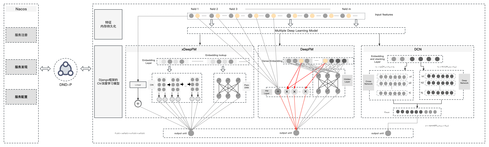
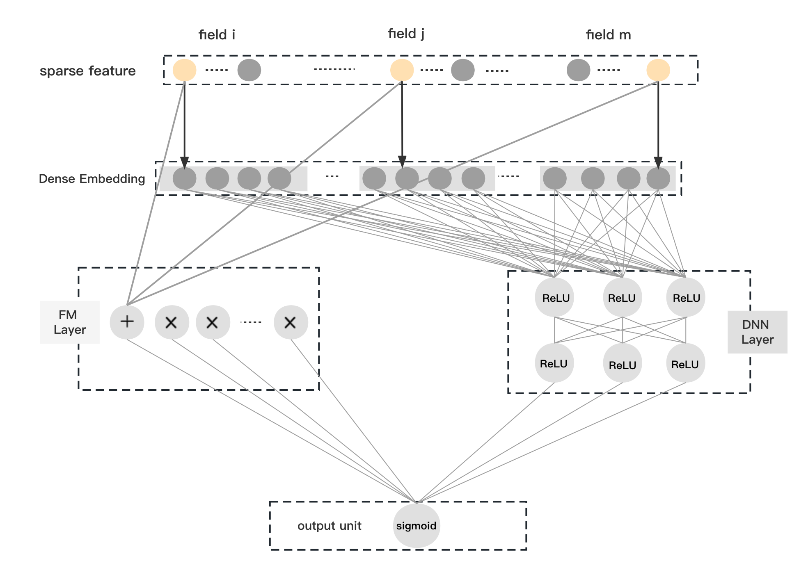
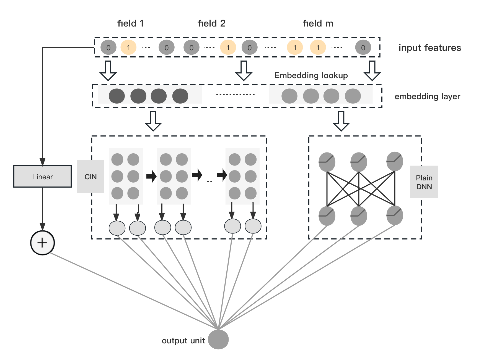

# ctr_mutil_models 

### Describe

The overall architecture of the integration of in-depth learning <a href="https://github.com/wzhe06/Ad-papers">CTR(Aggregation of Neural Network Models in the CTR Domain)</a> prediction model and Microservices architecture is shown in the figure above. DND-P is a Microservices protocol based on Django's integration with Nacos's protocol, which enables Nacos to detect the service where the CTR deep learning model is located in real time.

#### DCN & DeepFM & xDeepFM

DND-P is a Microservices protocol based on Django's integration with Nacos's protocol, which enables Nacos to detect the service where the CTR deep learning model is located in real time.

### Introduction to Project Directory Structure

* csv_data.zip  This contains the dataset in the experimental environment, which is a complete set.
* dcn_model_new.py It is the source code for the deep learning DCN model.
* deep_fm_model_new.py It is the source code for the deep learning DeepFM model.
* x_deep_fm_model_new.py It is the XDeepFM deep learning model.

### Train deep learning models
1. Unzip the csv_data.zip file and place the CSV files in the root directory.
2. Set hyperparameters for DCN, DeepFM, and XDeepFM models separately.
3. Run the above three deep learning models in a distributed manner on a GPU server. 
4. `python dcn_model_new.py`
5. `python deep_fm_model_new.py`
6. `python x_deep_fm_model_new.py`
You can also execute the man.py script to run the above three deep learning models sequentially.

### Flask Web
Put the trained models in the 'models' folder. If the 'models' folder does not exist, 
first create a 'models' folder in the same directory as 'app.py' and place the trained deep learning models in it.
#### Start the web service.
`python run app.py` 
